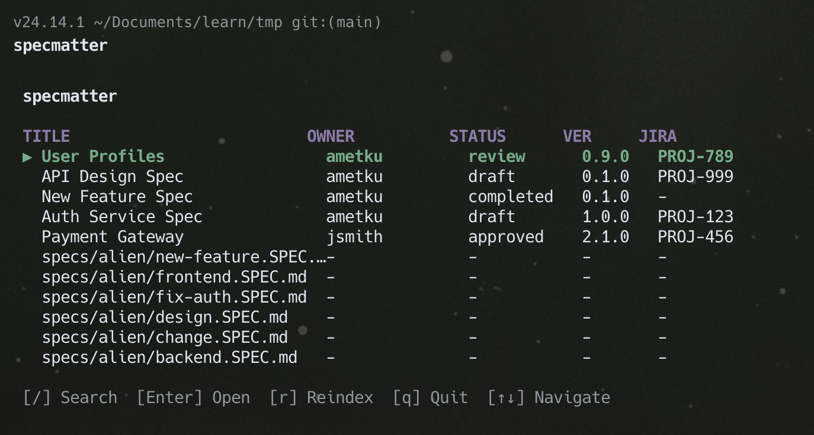

# specmatter

A CLI tool to index and browse SPEC.md files from the terminal.



## Install

```bash
npm install -g specmatter
```

Requires Node.js >= 20.

## Spec File Format

Spec files use the `.SPEC.md` extension and contain YAML frontmatter:

```markdown
---
title: Auth Service Spec
owner: ametku
version: 1.0.0
status: draft
jiraid: PROJ-123
---

# Auth Service

Your spec content here...
```

### Frontmatter Keywords

| Key | Description |
|-----|-------------|
| `title` | Spec title |
| `owner` | Author/owner of the spec |
| `version` | Spec version |
| `status` | Current status (freeform, e.g. draft, in-review, approved) |
| `jiraid` | Associated Jira ticket ID |

Any additional keys are also supported.

## Commands

### `specmatter init`

Initialize specmatter for the current repository. Scans for all `*.SPEC.md` files recursively and creates `.specmatter/index.json`.

```bash
cd my-repo
specmatter init
```

### `specmatter index`

Re-index all spec files. Use this to update the index after adding or modifying spec files outside of specmatter.

```bash
specmatter index
```

### `specmatter create <path>`

Create a new spec file with a frontmatter template.

```bash
specmatter create specs/new-feature.SPEC.md
```

Creates:

```markdown
---
title: ""
owner: ""
version: "0.1.0"
status: "draft"
jiraid: ""
---

# Spec Title

## Overview

## Requirements

## Design
```

### `specmatter <spec-path> make [--key value ...]`

Add frontmatter to an existing markdown file. Pass `--key value` pairs to set initial values.

```bash
specmatter docs/design.SPEC.md make --title "Design Spec" --owner ametku --jiraid PROJ-456
```

Defaults: `version: 0.1.0`, `status: draft`. Refuses to overwrite existing frontmatter.

### `specmatter <spec-path> set <key> <value>`

Set a frontmatter value on a spec file. Updates both the file and the index.

```bash
specmatter specs/auth.SPEC.md set status approved
specmatter specs/auth.SPEC.md set owner jsmith
```

### `specmatter <spec-path> get <key>`

Read a frontmatter value from a spec file.

```bash
specmatter specs/auth.SPEC.md get status
# approved
```

### `specmatter` / `specmatter dashboard`

Open the terminal dashboard. Running `specmatter` with no arguments opens the dashboard if an index exists, otherwise shows help.

```bash
specmatter
```

#### Dashboard Keybindings

| Key | Action |
|-----|--------|
| `/` | Open search (filters by title and status) |
| `Esc` | Clear search |
| `Enter` | Open selected spec file |
| `↑` / `↓` | Navigate specs |
| `r` | Reindex (refresh from disk) |
| `q` | Quit |

## Index File

The index lives at `.specmatter/index.json` and contains metadata, file paths, and full content of each spec. Add `.specmatter/` to your `.gitignore`.

## Development

```bash
git clone <repo>
cd specmatter
npm install
npm run build
npm link
```

| Script | Description |
|--------|-------------|
| `npm run build` | Build with tsup |
| `npm run dev` | Run directly via tsx (no build) |
| `npm test` | Run tests with vitest |
